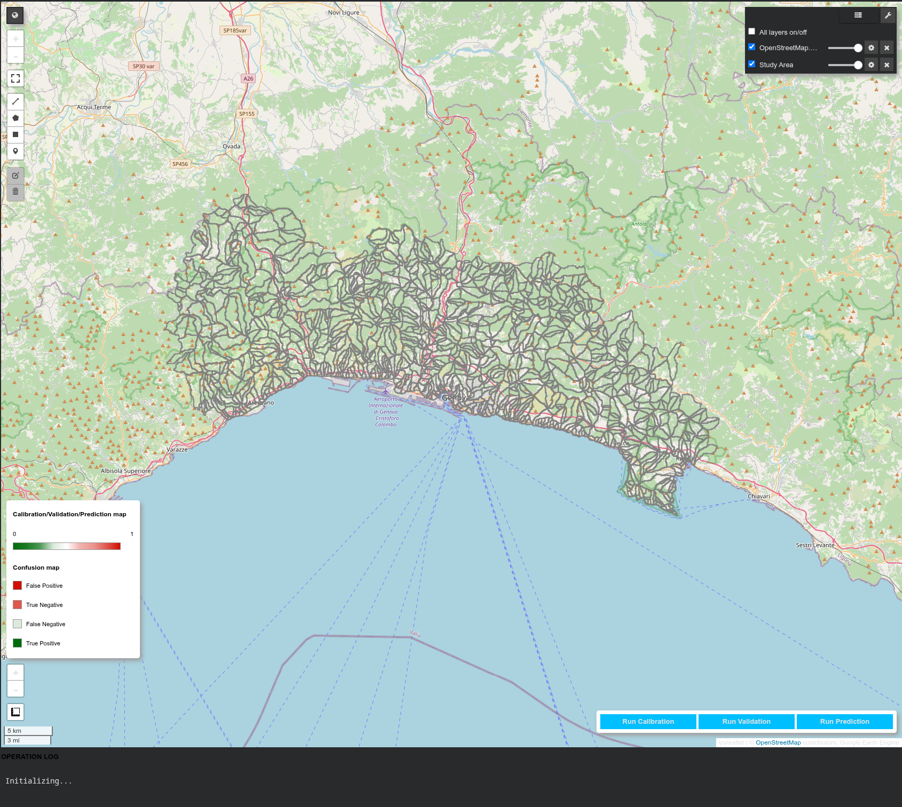
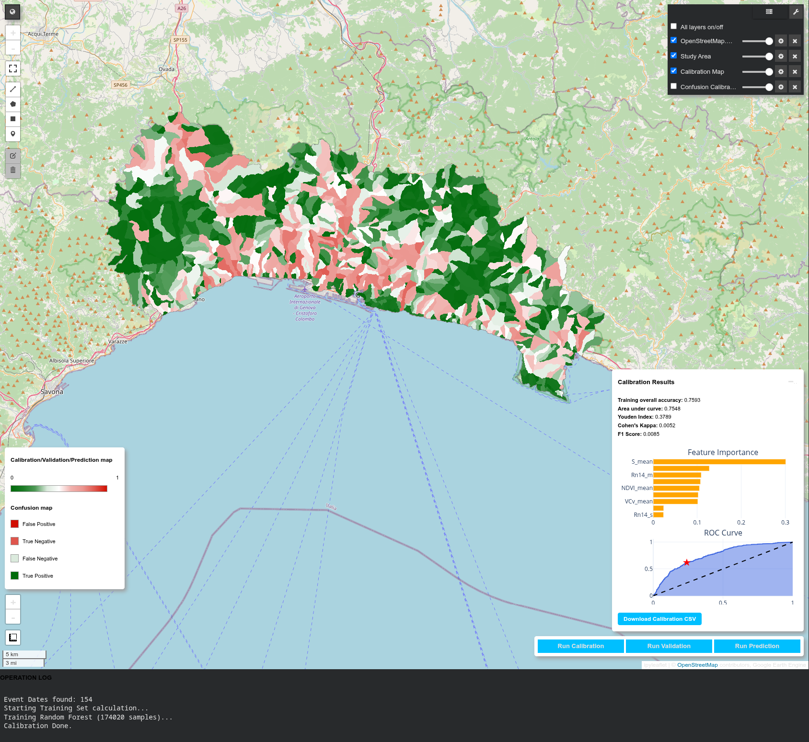
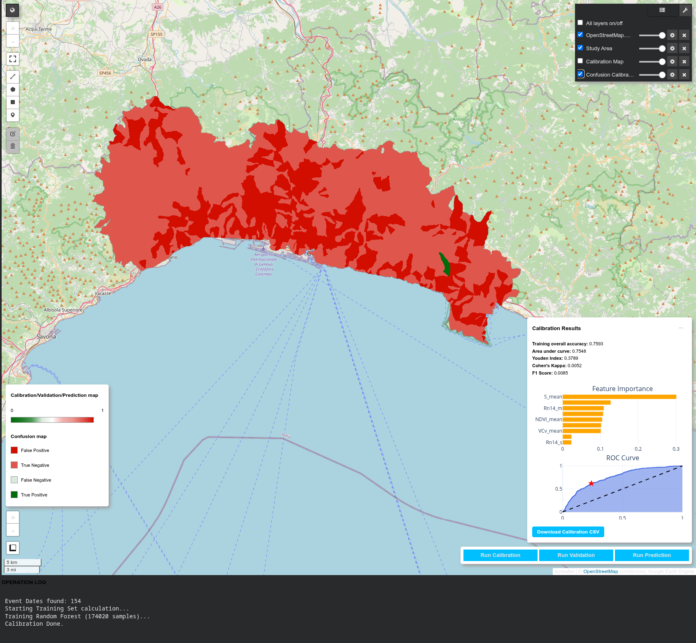
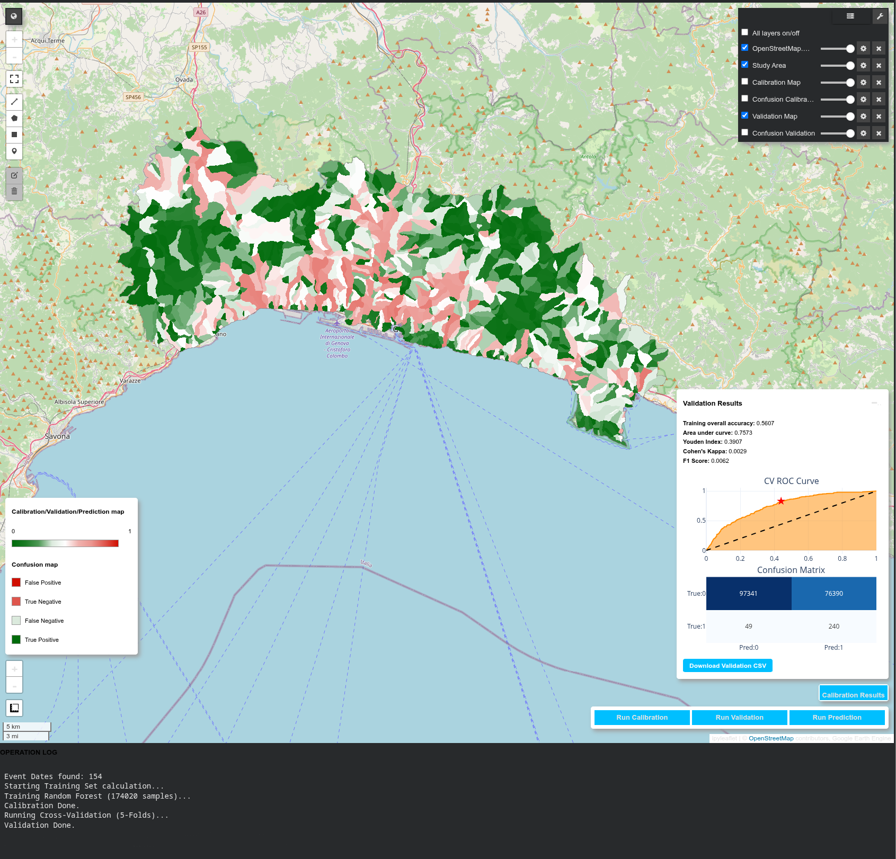
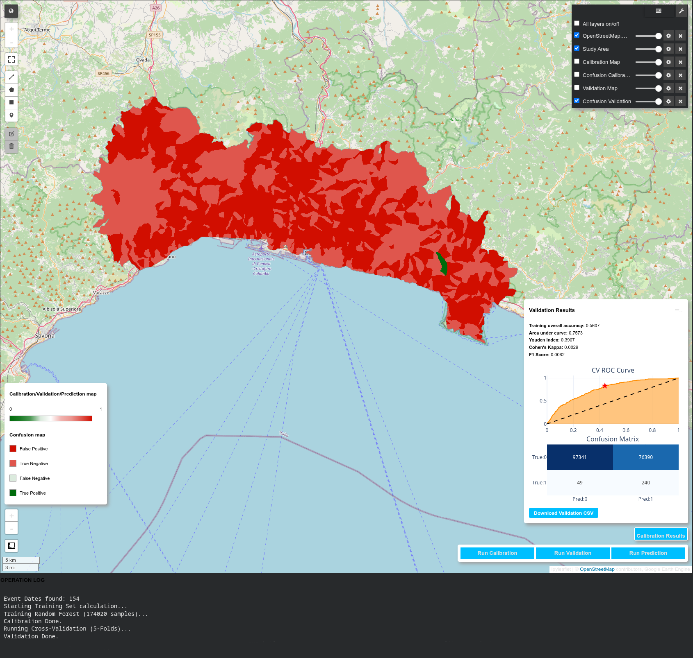
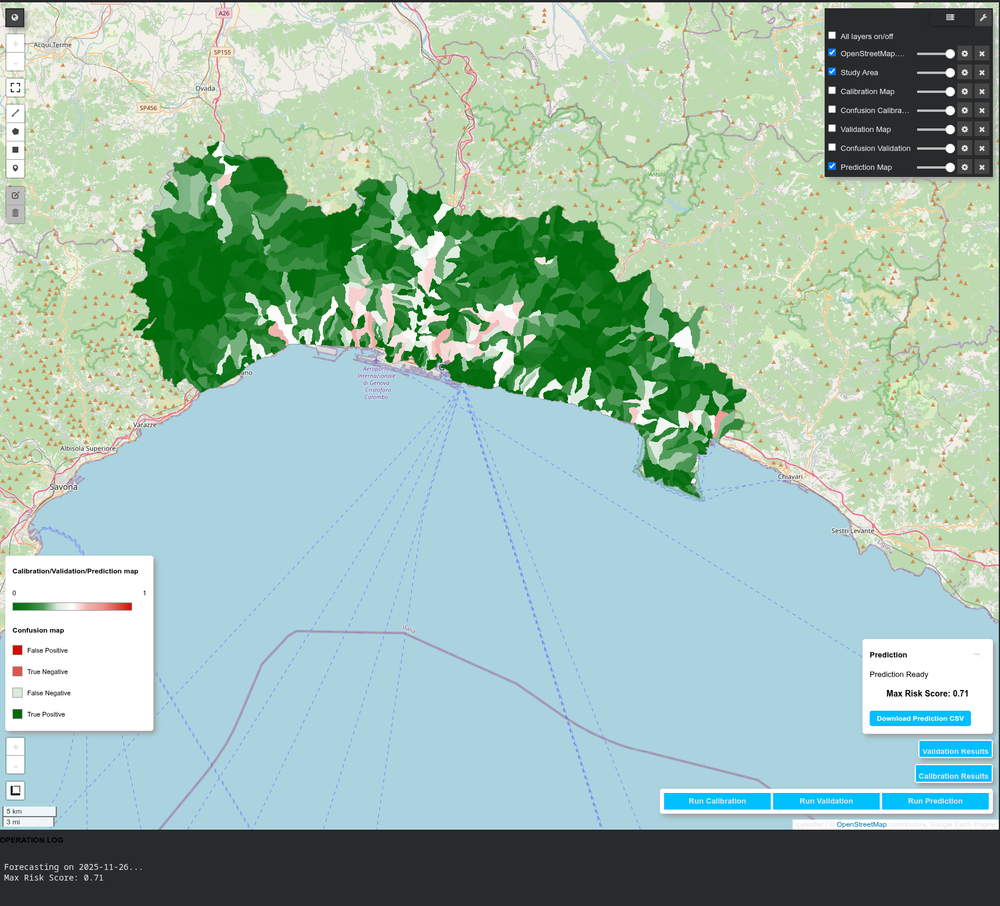

# PySTGEE: Space-Time Landslide Susceptibility with Google Earth Engine

**PySTGEE** is a Python-based implementation of a **Space-Time Landslide Susceptibility** assessment workflow. It leverages the computational power of Google Earth Engine (GEE) for spatial data reduction and the flexibility of the Scikit-learn library for Machine Learning modeling.

This tool allows users to calibrate, cross-validate, and predict landslide susceptibility over a selected study area using a Random Forest model. By integrating static morphological factors with dynamic antecedent rainfall derived from satellite missions (GPM), PySTGEE extends traditional static susceptibility mapping into the temporal domain.

## Application Overview

The application is designed to run in a Jupyter/Colab environment and automates the retrieval of environmental predictors, the training of the machine learning model, and the visualization of results.

### Key Features
* **Space-Time Integration**: Merges static terrain units (e.g., Slope Units) with dynamic rainfall variables (7-day and 14-day cumulative rainfall) extracted from the JAXA GPM/GSMaP operational dataset (`JAXA/GPM_L3/GSMaP/v8/operational`).
* **Machine Learning Core**: Utilizes a Random Forest Classifier (via `scikit-learn`) configured with balanced class weights to handle dataset imbalance.
* **Rigorous Validation**: Implements Stratified K-Fold Cross-Validation to assess model robustness and generalization capabilities.
* **Interactive Dashboard**: Features a Graphical User Interface (GUI) built with `ipywidgets` and `geemap` for real-time interaction, threshold optimization (Youden's J statistic), and spatial visualization of model performance.

## Run/Edit application
From [here](https://huggingface.co/spaces/gabrielenapolinic/PySTGEE) you can run our application.

## How to Use

### Data Requirements
The PySTGEE workflow requires the definition of three specific Earth Engine assets in the configuration section:

1.  **Polygons Asset (Map Units)**: A feature collection defining the spatial domain (e.g., Slope Units or Grid Cells). These geometries must contain the static independent variables (e.g., Slope, Relief, Lithology, NDVI).
2.  **Points Asset (Inventory)**: A feature collection of historical landslide occurrences. Crucially, this dataset must include a temporal attribute (date of the event) to allow the association with dynamic rainfall data.
3.  **Prediction Asset**: The target feature collection for the forecasting phase (typically identical to the Polygons Asset).

### Automated Data Reduction (SRT Logic)
Similar to the Spatial Reduction Tool (SRT), this script acts as a collector and spatial reducer of data from GEE. During the training phase, the script iterates through the historical event dates, retrieves the corresponding rainfall rasters, and calculates spatial statistics (mean and standard deviation) for each map unit using the `reduceRegions` method.

## Workflow and Interface

The following sections illustrate the operational steps of the tool, ordered by execution task.

### 1. Initialization and Data Loading
Upon execution, the script authenticates with GEE, loads the user-defined vector assets, and renders the study area on the interactive map. The control dashboard is initialized in the bottom-right corner.

### 2. Model Calibration
The calibration process involves training the Random Forest model on the dataset constructed from historical events. The dashboard displays the Feature Importance plot and the Receiver Operating Characteristic (ROC) curve. The map renders the resulting susceptibility probability distribution for the calibration set.

### 3. Calibration Diagnostics (Spatial Confusion Matrix)
To assess the spatial accuracy of the calibration, the tool generates a map of the Confusion Matrix classes. This visualization distinguishes between True Positives, False Positives, True Negatives, and False Negatives, helping to identify specific morphological units where the model systematically fails.

### 4. Cross-Validation
The validation module executes a 5-Fold Stratified Cross-Validation. The results panel updates to show the Validation ROC Curve and a numeric Confusion Matrix aggregated from the folds. The map visualization updates to show the susceptibility map derived from the validation predictions.

### 5. Validation Diagnostics
This step visualizes the spatial distribution of prediction errors during the cross-validation phase. It provides insights into the model's ability to generalize to unseen data and highlights areas of spatial overfitting or underfitting.

### 6. Prediction and Forecasting
In the final step, the user defines a target forecast date. The system retrieves the specific rainfall conditions for that date and applies the trained model to generate a "Future Scenario" susceptibility map, identifying areas at high risk under those specific meteorological conditions.

## Dependencies
* `earthengine-api`
* `geemap`
* `scikit-learn`
* `pandas`
* `numpy`
* `plotly`
* `ipywidgets`

## License

This project is licensed under the **GNU General Public License v3.0** (GPLv3).

This program is free software: you can redistribute it and/or modify it under the terms of the GNU General Public License as published by the Free Software Foundation, either version 3 of the License, or (at your option) any later version.

This program is distributed in the hope that it will be useful, but WITHOUT ANY WARRANTY; without even the implied warranty of MERCHANTABILITY or FITNESS FOR A PARTICULAR PURPOSE. See the GNU General Public License for more details.

## Contacts
The STGEE/PySTGEE methodology has been authored by **Giacomo Titti** and **Gabriele Nicola Napoli**.

For any request, comment, or suggestion, please write to: gabrielenicolanapoli@gmail.com or giacomotitti@gmail.com

## Cite
Please cite us:

* Titti, G., Nicola Napoli, G., Lombardo, L. (2022). giactitti/STGEE: STGEE v1.1 (v1.1). Zenodo. https://doi.org/10.5281/zenodo.6471966
* Titti, G., Nicola Napoli, G., Conoscenti, C., Lombardo, L. (2022). Cloud-based interactive susceptibility modeling of gully erosion in Google Earth Engine. *International Journal of Applied Earth Observation and Geoinformation*, 115. DOI: 10.1016/j.jag.2022.103089
