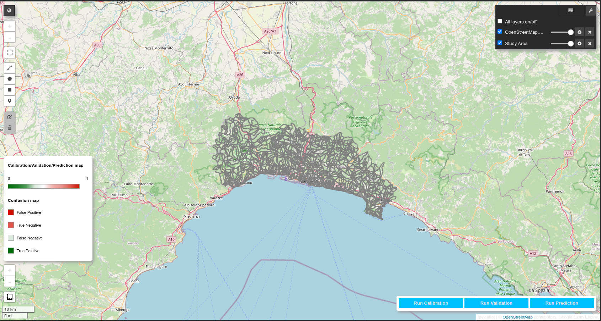
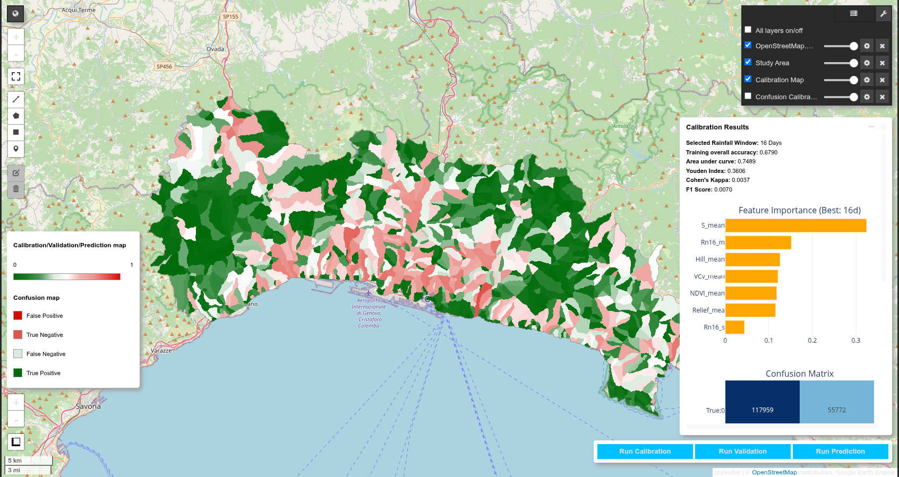
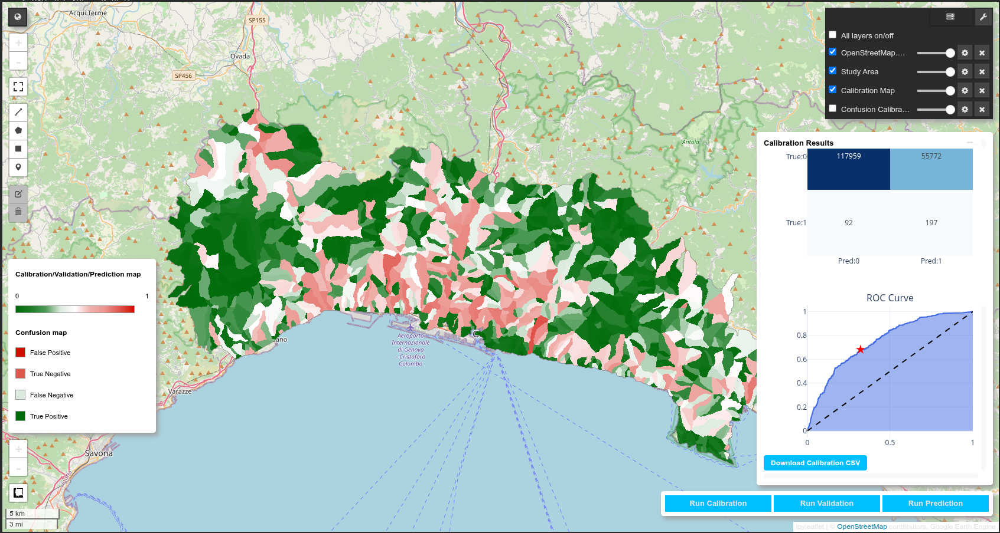
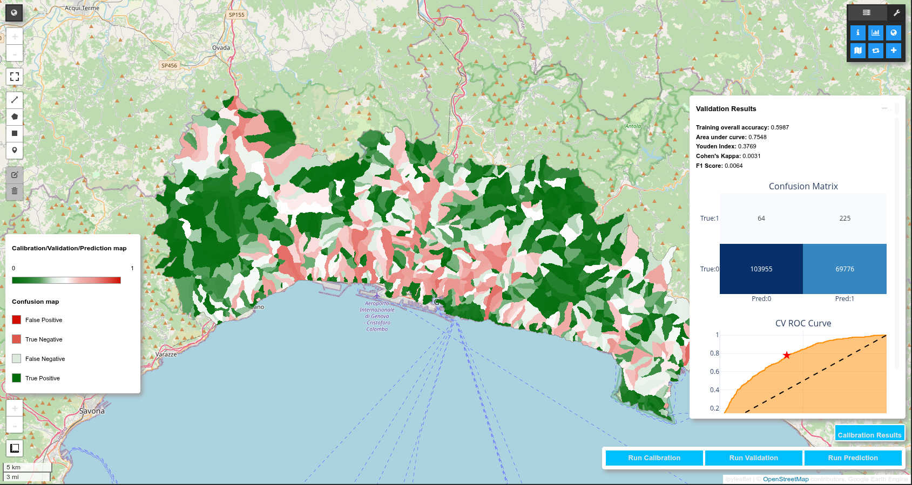
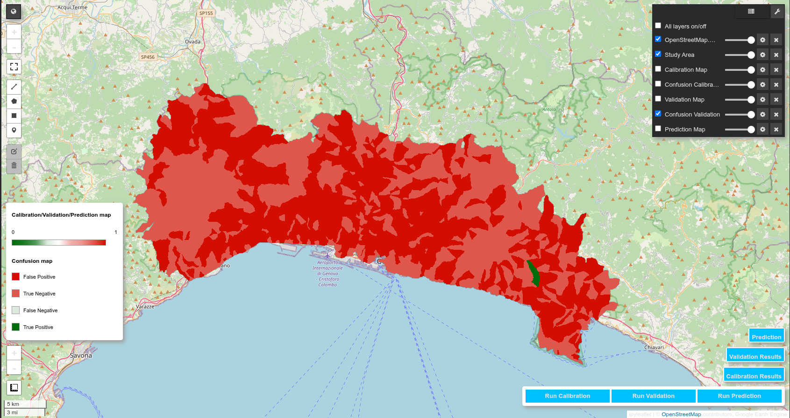
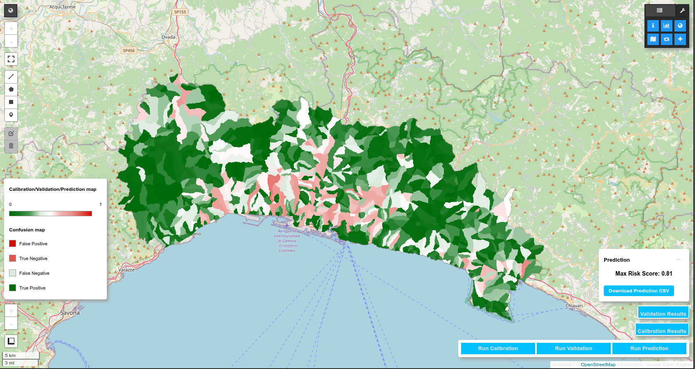

# PySTGEE: Automated Spatio-Temporal Landslide Susceptibility Pipeline

---

## Overview

**PySTGEE** is an automated geospatial workflow designed for multi-scale, continuous landslide susceptibility modeling. By bridging **Google Earth Engine (GEE)** dynamic rainfall extractions with pre-trained **Random Forest machine learning pipelines**, the system evaluates spatio-temporal hazard levels across thousands of morphological units (Slope Units / Catchments).

This repository is fully autonomous: **GitHub Actions** executes the prediction engine daily, updating the live web map and generating GIS-ready datasets without manual intervention.

---

## Key Features

* **Autonomous Daily Forecasts:** Evaluates upcoming 24-48h landslide susceptibility using ECMWF weather forecasts and historical GSMaP satellite precipitation accumulations.
* **High-Fidelity Web Rendering:** Converts over 49,000+ polygon geometries into crisp, zero-lag raster image overlays (`ImageOverlay`) for seamless browser navigation.
* **Integrated UI Dashboard:** Features a custom floating UI on the web map displaying real-time monitoring statistics (Active Rain Zones, Max Risk Index, Date).
* **Direct GIS Interoperability:** Allows instant download of uncompressed, topologically preserved `.geojson` vector layers directly from the web interface, ready for QGIS or ArcGIS analysis.
* **Space-Time Integration**: Merges static terrain units (e.g., Slope Units) with dynamic rainfall variables (7-day and 14-day cumulative rainfall) extracted from the JAXA GPM/GSMaP operational data.
* **Machine Learning Core**: Utilizes a Random Forest Classifier (via `scikit-learn`) configured with balanced class weights to handle dataset imbalance.
* **Rigorous Validation**: Implements Stratified K-Fold Cross-Validation to assess model robustness and generalization capabilities.

---

## Repository Structure

* `daily_prediction.py`: Core master script. Handles GEE authentication, dynamic rainfall extraction, machine learning inference, rasterization, and web dashboard generation.
* `.github/workflows/daily_run.yml`: Continuous integration pipeline scheduled to run autonomously every night.
* `daily_maps/`: Directory storing chronological outputs and the zero-touch routing alias files (`latest_map.geojson` and `latest_map.html`).
* `index.html`: The root entry point for GitHub Pages, serving the latest interactive full-screen map dashboard.

---

## Data Download for GIS Users

To inspect the raw prediction values and geometries in your local GIS software:

1. Open the [Live Web Dashboard](https://gabrielenapolinic.github.io/PySTGEE/).
2. Click the green **"⬇ Download GIS Data (.geojson)"** button located in the top-right information panel.
3. Drag and drop the downloaded file directly into QGIS. Key attribute fields include:
   * `poly_uid`: Unique polygon identifier.
   * `Susceptibility_Prob`: Static morphological susceptibility probability.
   * `Rn_m`: Accumulated antecedent precipitation (in mm).
   * `Final_Dynamic_Susceptibility`: Spatio-temporal combined hazard index (0.0 to 1.0).

---

## Application Overview

The application is designed to run in a Jupyter/Colab environment and automates the retrieval of environmental predictors, the training of the machine learning model, and the visualization of results.

### How to Use

#### Data Requirements

The PySTGEE workflow requires the definition of three specific Earth Engine assets in the configuration section:

1.  **Polygons Asset (Map Units)**: A feature collection defining the spatial domain (e.g., Slope Units or Grid Cells). These geometries must contain the static independent variables (e.g., Slope, Relief).
2.  **Points Asset (Inventory)**: A feature collection of historical landslide occurrences. Crucially, this dataset must include a temporal attribute (date of the event) to allow the association with the dynamic rainfall variables.
3.  **Prediction Asset**: The target feature collection for the forecasting phase (typically identical to the Polygons Asset).

#### Automated Data Reduction (SRT Logic)

Similar to the Spatial Reduction Tool (SRT), this script acts as a collector and spatial reducer of data from GEE. During the training phase, the script iterates through the historical event dates, retrieving and aggregating relevant rainfall information.

---

## Workflow and Interface

The following sections illustrate the operational steps of the tool, ordered by execution task.

### 1. Initialization and Data Loading

Upon execution, the script authenticates with GEE, loads user-defined vector assets, and renders the study area on the interactive map. The control dashboard is initialized in the bottom-right corner.

### 2. Model Calibration

The calibration phase involves training the Random Forest model using a dataset constructed from historical events. The dashboard displays the Feature Importance plot and the Receiver Operating Characteristic (ROC) curve.

### 3. Calibration Diagnostics (Spatial Confusion Matrix)

To assess spatial accuracy, the tool generates a map of the Confusion Matrix classes. This visualization distinguishes between True Positives, False Positives, True Negatives, and False Negatives, helping identify model strengths and weaknesses across the study area.

### 4. Cross-Validation

The validation module executes a 10-Fold Stratified Cross-Validation. The results panel updates to show the Validation ROC Curve and a numeric Confusion Matrix aggregated from all folds. Simultaneously, the map displays the spatial distribution of validation results.

### 5. Validation Diagnostics

This step visualizes the spatial distribution of prediction errors during the cross-validation phase. It provides insights into the model's ability to generalize to unseen data, highlighting areas of high and low prediction confidence.

### 6. Prediction and Forecasting

In the final step, the user defines a target forecast date. The system retrieves specific rainfall conditions for that date and applies the trained model to generate a "Future Scenario" susceptibility map with updated dynamic variables.

---

## Dependencies

* `earthengine-api`
* `geemap`
* `scikit-learn`
* `pandas`
* `numpy`
* `plotly`
* `ipywidgets`

---

## License

This project is licensed under the **GNU General Public License v3.0** (GPLv3).

This program is free software: you can redistribute it and/or modify it under the terms of the GNU General Public License as published by the Free Software Foundation, either version 3 of the License, or (at your option) any later version.

This program is distributed in the hope that it will be useful, but WITHOUT ANY WARRANTY; without even the implied warranty of MERCHANTABILITY or FITNESS FOR A PARTICULAR PURPOSE. See the GNU General Public License for more details.

---

## Authors & Credits

* **Gabriele Nicola Napoli**
* **Giacomo Titti**

*Original STGEE JavaScript framework developed in 2022. Python refactoring and automated pipeline implementation (2026).*

---

## Contacts

The STGEE/PySTGEE methodology has been authored by **Giacomo Titti** and **Gabriele Nicola Napoli**.

For any request, comment, or suggestion, please write to: gabrielenicolanapoli@gmail.com or giacomotitti@gmail.com

---

## Cite

Please cite us:

* Titti, G., Nicola Napoli, G., Lombardo, L. (2022). giactitti/STGEE: STGEE v1.1 (v1.1). Zenodo. https://doi.org/10.5281/zenodo.6471966
* Titti, G., Nicola Napoli, G., Conoscenti, C., Lombardo, L. (2022). Cloud-based interactive susceptibility modeling of gully erosion in Google Earth Engine. *International Journal of Applied Earth Observation and Geoinformation*.
